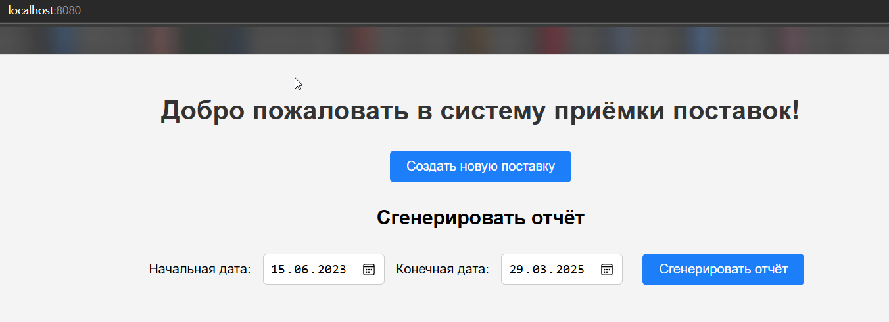
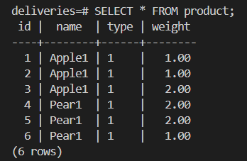
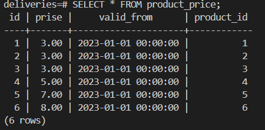
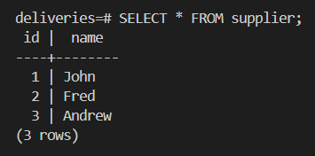

# acceptance-of-deliveries

## Первый запуск

Для запуска нужно выполнить команду  ```./gradlew BootJar``` и ``` docker-compose up ```

### Homepage

* 

База данных иннициализируется начальными значениями:

* 

```Таблица Product```

* 

```Таблица product_price```

* 

```Таблица Supplier```

## API Эндпоинты

### Поставки

* **POST api/deliveries:** Создать новую поставку(через JSON).
* **POST /delivery/new:** Создать новую поставку(через web-интерфейс).

### Отчеты

* **GET /report/generate:** Генерация отчета для поставок за указанный период.
* **GET /reports:** Генерация отчета для поставок за всё время.

## Примеры

Для создания поставки(api/deliveries):

* 

Для создания отчёта с интерфейсом (report/generate):

* 

Для создания поставки с интерфейсом  (delivery/new):

* 

Для создания отчёта (api/report/generate):

* 
