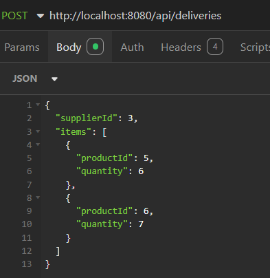
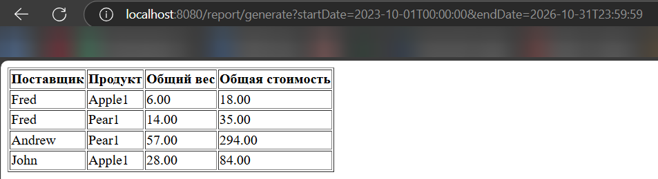
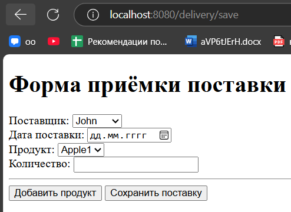
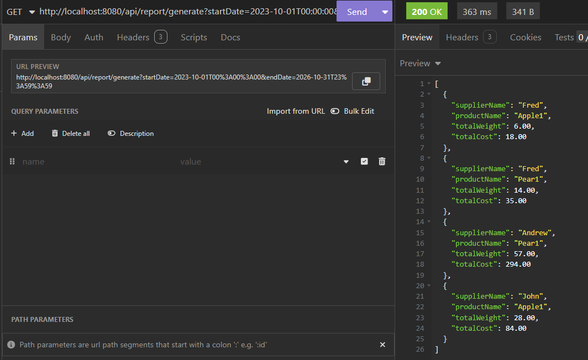

# acceptance-of-deliveries

## Первый запуск

Для запуска нужно выполнить команду  ```./gradlew BootJar``` и ``` docker-compose up ``` 

## Реализованное API

Для создания поставки(api/deliveries):

* 

Для создания отчёта с интерфейсом (api/report/generate):

* 

Для создания поставки с интерфейсом  (delivery/new):

* 

Для создания отчёта (api/report/generate):

* 
